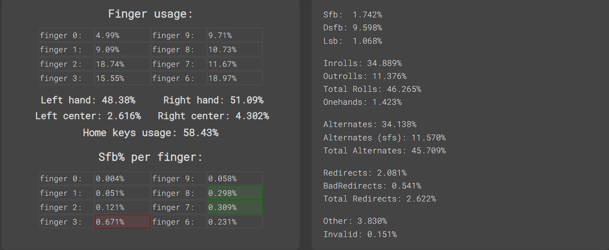
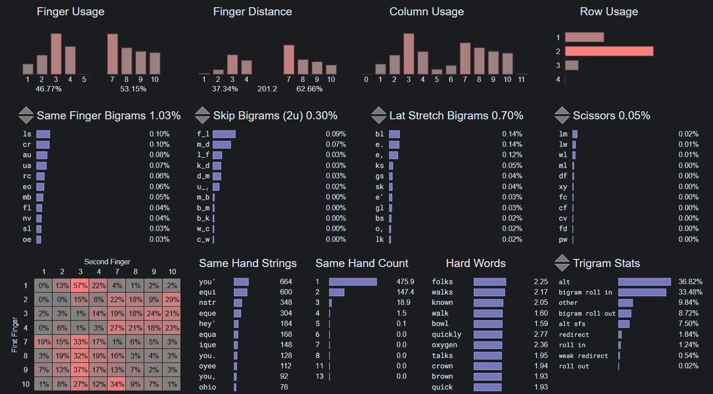

# Magic Roll
A handmade, alternative keyboard layout that uses multiple repeat and magic keys for a more comfortable and optimal typing experience.
```
  j y o u '  b d l c p 
? h i e a .  g t s r n z
  x q 𝕊 @ ,  k m f w v
         ★  ␣ ☆

𝕊 = Symbol Layer
@ = Repeat
★ = Left Magic
☆ = Right Magic
```
## Table of Contents:
- [Glossary](glossary.md)
- [Stats](#stats)
- [Design](#design)
  - [Thumb Keys](#thumb-keys)
  - [Left Half](#left-half)
  - [Right Half](#right-half)
- [Magic Functions](#magic-functions)
---
<details>
  <summary><h2>Stats:</h2></summary>
Without repeat or magic unless specified.

**[Layout Playground](https://oxey.dev/playground/index.html "Layout Playground"):**

**[Layout Playground](https://oxey.dev/playground/index.html "Layout Playground")** (With Repeat):

**[Cyanophage](https://cyanophage.github.io/playground.html?layout=jyou%27bdlcp-hiea.gtsrnzxq%5C%3D%2Ckmfwv%2F%3B&mode=ergo&lan=english "View on Cyanophage"):**

**[KeySolve](https://drowningnewt.github.io/keysolve-web "Keysolve"):**


</details>

---
**Typing Test:**


### <ins>Design:

Using [Hyperroll](https://docs.google.com/document/d/1_a5Nzbkwyk1o0bvTctZrtgsee9jSP-6I0q3A0_9Mzm0/edit?tab=t.0#heading=h.an6umzmpc3dj "Hyperroll Keyboard Layout") 
as a base, I went through about two dozen iterations before I had something I was happy with. Most of that was just experimenting while keeping `HIEA` + `YOU` in place. My goals were to have a reasonable consonant-hand pinky, keep one-handed strings and awkward patterns to a minimum, and use repeat and magic to improve the layout further. The [Layout Playground](https://oxey.dev/playground/index.html "Layout Playground") analyzer and [MonkeyType's](https://monkeytype.com "MonkeyType") word filter helped me do just that, along with a lot of trial and error.

#### *Thumb Keys:*
Each thumb has a magic key that's used to turn most SFBs into rolls and make certain patterns more comfortable. The outputs are strictly 1:1 to keep them more like normal keys. Not only does this make using them simpler, but they won't get you banned from typing websites as well.
In general, if the previous key was on the same hand, the output will be the key above or below it. *E.g. `E★` → `EO`. `O★` → `OE`*

[AutoHotKey](https://www.autohotkey.com "AutoHotkey's Website") was used since I couldn't be bothered to implement it with [QMK](https://docs.qmk.fm/features/repeat_key#functions "QMK Repeat/Magic Documentation").

A list of every magic function will be provided at the bottom.

#### *Left Half:*
The left side has no common consonants other than `H` to minimize outrolls, redirects, and long one-handed sequences. This *does* put more of a burden on the right hand but I haven't had any issue with it.

Punctuation is almost entirely on the inner index column except for question mark. I needed to make room for the repeat key so it got pushed to the outer pinky column, while the rest of the symbols were put on another layer.

Repeat was put on the index, as I don't find thumb → finger rolls to be that comfortable. I also didn't have a free thumb key for it and wasn't willing to give up magic on either side. Thankfully, this placement doesn't really cause any  problems. Even though it *does* introduce a few new SFBs, they can be fixed with magic or alt-fingering. 
Additionally, this key outputs `T` after `H`, `U` after `Q`, and `backspace` after repeats and all other situations.

`X` and `J` have been given magic functionality to reduce consonant hand outrolls. These letters almost never pair with the other consonants so they're perfect for this task. This also helps to lighten the right hand load a little bit.

#### *Right Half:*
Most of the consonants have been placed on this side. SFBs were disregarded, as I planned to fix them with magic. The `LSF` and `CRW` columns are somewhat questionable but magic makes them viable.
wip

---

### <ins>Magic Functions:
```
★:
  ★ → Shift
  ☆★ → ␣
  .★ → ." 
  ,★ → ,"
  ?★ → ?"
  !★ → !"
  @★ → @"
  "★ → "A
  A★ → AU
  B★ → BT
  E★ → EO
  F★ → FZ
  H★ → H?
  I★ → IQ
  J★ → JH
  K★ → KG
  L★ → LS
  M★ → MP
  N★ → NP
  O★ → OE
  P★ → PV
  Q★ → QI
  R★ → RP
  S★ → SZ
  T★ → TX
  U★ → UA
  V★ → VP
  W★ → WL
  X★ → XI
  Y★ → YI 

☆:
  ★☆ → U
  .☆ → ..
  A☆ → A.
  C☆ → CC
  D☆ → DM
  E☆ → EY
  F☆ → FL
  G☆ → GM
  H☆ → HH
  I☆ → IY
  J☆ → JO
  L☆ → LS
  M☆ → MP
  N☆ → NV
  O☆ → OX
  P☆ → PN
  Q☆ → QU
  R☆ → RC
  S☆ → SL
  T☆ → TR
  U☆ → U,
  W☆ → WL
  X☆ → XH

J:
  KJ → KN
  LJ → LR
  RJ → RV
  SJ → SW
  TJ → TD
  WJ → WN

H:
  FH → FR

X:
  ☆X → ☆L
  @X → @A
  BX → BR
  CX → CR
  DX → DR
  FX → FL
  GX → GR
  KX → KT
  LX → LV
  MX → MB
  PX → PR
  RX → RP
  SX → SP
  TX → TW
  WX → WR

Q:
  @Q → @U
  BQ → BM
  LQ → LF
  RQ → RZ

Z:
  DZ → DT
  FZ → FS
  GZ → GT
  LZ → LW
  MZ → MT
  RZ → RW
  SZ → SF
B:
  CB → CK

G:
  CG → CH
  SG → SC
```
