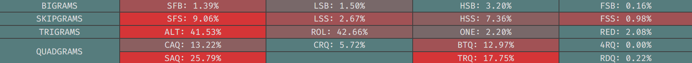

# Magic Roll
A handmade, alternative keyboard layout that uses multiple repeat and magic keys for a more comfortable and optimal typing experience.
```
  j y o u '  b d l c p 
? h i e a .  g t s r n z
  x q 𝕊 @ ,  k m f w v
         ★  ␣ ☆

𝕊 = Symbol Layer
@ = Repeat
★ = Left Magic
☆ = Right Magic
J, H, X, Q, B, G, K, and Z double as magic keys
```
## Table of Contents:
- [Glossary](glossary.md)
- [Stats](#stats)
- [Design](#design)
  - [Thumb Keys](#thumb-keys)
  - [Left Half](#left-half)
  - [Right Half](#right-half)
  - [Tools Used](#tools-used) 
- [Magic Functions](#magic-functions)
---
<details>
  <summary><h2>Stats:</h2></summary>
Without repeat or magic unless specified.

**[Layout Playground](https://oxey.dev/playground/index.html "Layout Playground"):**

**[Layout Playground](https://oxey.dev/playground/index.html "Layout Playground")** (With Repeat):

**[Cyanophage](https://cyanophage.github.io/playground.html?layout=jyou%27bdlcp-hiea.gtsrnzxq%5C%3D%2Ckmfwv%2F%3B&mode=ergo&lan=english "View on Cyanophage"):**

**[KeySolve](https://drowningnewt.github.io/keysolve-web "Keysolve"):**


</details>

---
**Typing Test:**


### <ins>Design:

Using [Hyperroll](https://docs.google.com/document/d/1_a5Nzbkwyk1o0bvTctZrtgsee9jSP-6I0q3A0_9Mzm0/edit?tab=t.0#heading=h.an6umzmpc3dj "Hyperroll Keyboard Layout") as a starting point, I experimented with pretty much everything except for `HIEA` + `YOU`. I knew I wanted to keep those letters together for the inrolls and prioritize comfort but I didn't really know what I wanted beyond that. As I figured out my preferences, I aimed for lower outrolls, inner column use and one-handed strings. I went through about two dozen [iterations](layout_design_progression.md "Layout Design Progression") before I had something I was happy with, then added repeat and magic to improve the layout further.

#### *Thumb Keys:*
Each thumb has a magic key that's used to eliminate most SFBs and make certain patterns more comfortable. The outputs have been kept 1:1 to keep them more like normal keys and less like macros. This makes using them simpler and ensures that you won't get banned from typing websites either.

In general, if the previous key was on the same hand, the output will be the key above or below it. *E.g. `E★` → `EO`. `O★` → `OE`*

If the previous key was on the opposite hand, the output will be something a little less useful like fixing the same (or different) SFB, or an awkward pattern. *E.g. `L★` → `LS`. `Q☆` → `QU`*. `☆ → Space` SFBs can also be avoided this way.

#### *Left Half:*
The left half was arranged around `HIEA` + `YOU`. It's the best for inrolls, as `H` almost always comes before a vowel. On top of that, there are no common consonants on this side to keep redirects and one-handed strings low.

<details>
  <summary>Roll Direction Chart:</summary>

Source: https://docs.google.com/document/d/1W0jhfqJI2ueJ2FNseR4YAFpNfsUM-_FlREHbpNGmC2o/edit?tab=t.2yb5bwiy1wa8#heading=h.qyel7qja61lm
</details>

Magic `X` and `J` complete the pinky column. They turn most consonant-hand outrolls into alternates, and since a vowel almost always comes after, they become inrolls. These letters basically never pair with the other consonants so they're perfect for this job. *E.g. `BX` → `BR` `SJ` → `SW`*

Magic `Q` completes the ring column. It doesn't do much besides fix a few SFBs and uncomfortable patterns.

Punctuation is almost entirely on the inner index column except for `?`. I needed to make room for the repeat key so it got pushed to the outer pinky column, with the rest of the symbols being put on another layer.

`Repeat` was put on the index since I didn't have a free thumb key for it and wasn't willing to give up magic on either side. This placement doesn't really cause any problems though, as the new SFBs can be fixed with magic or alt-fingering. 

Additionally, this key doesn't just repeat the last letter:
- `H@` → `HT`. `HH` is extremely uncommon so I made `HT` a roll instead.
- `Q@` → `QU`. `QQ` is even more uncommon and since `U` is two rows above `Q`, it's little uncomfortable to type normally. I prefer to just use the right magic key for this though.
- `Backspace` after repeats and in all other situations. This brings up the index's usage and gets backspace off the pinky.

#### *Right Half:*
The right half was arranged around the `TSRN` home keys, as these are the most frequently used consonants:
- `T` is the most used so it goes on the index.
- `S` and `R` go on the middle and ring to make `ST` and `RS` inrolls.
- `N` pairs with every letter so putting it on the pinky makes every letter that follows an inroll as well.

<details>
  <summary>Letter Frequencies Chart:</summary>
  


Source: https://www.norvig.com/mayzner.html
</details>

The `BGK` inner index column was set up to make `NG`, `RK`, and `BL` more comfortable. `D + BGK` are easily alt-fingerable. Magic allows me to place `M` and `B` on the same finger **and** two rows apart without any issue.

The `LSF` and `CRW` columns are a little questionable but with nearly all of the consonants on this side, there weren't many other options. Magic makes these columns viable though, as you just have to fix `FL/LF` and `CR/RC`. You could swap `L` and `C` instead but then you'd lose the `CL` and `RLD` inrolls, and make `NCL` a redirect.

The `PNV` column, while good if it was on any other finger, isn't great on the pinky. The SFBs are low but it's usage is relatively high. the SFSs are really noticable as well. Swapping `P` with `K` or `B` could be potential solutions though.

Aside from all of the movement this hand has to do, the pinky and SFSs in general are this layout's biggest downsides

### <ins>Tools Used:
- The [Keyboard Layouts Google Doc](https://docs.google.com/document/d/1W0jhfqJI2ueJ2FNseR4YAFpNfsUM-_FlREHbpNGmC2o "Keyboard Layouts Google Doc") for design knowledge
- The [Layout Playground](https://oxey.dev/playground/index.html "Layout Playground") analyzer for drag and drop letter swaps and their resulting stats
- The [Cyanophage](https://cyanophage.github.io "Cyanophage Analyzer") analyzer for more stats
- [MonkeyType's](https://monkeytype.com "MonkeyType") word filter for specific bigram, trigram, etc. frequencies
- [AutoHotkey](https://www.autohotkey.com "AutoHotkey's Website") to handle repeat and magic functions, since I couldn't be bothered to implement them with [QMK](https://docs.qmk.fm/features/repeat_key "QMK Repeat/Magic Documentation")

---

### <ins>Magic Functions:
```
★:
  ★ → Shift
  ☆★ → ␣
  .★ → ." 
  ,★ → ,"
  ?★ → ?"
  !★ → !"
  "★ → "A
  A★ → AU
  B★ → BT
  E★ → EO
  H★ → H?
  I★ → IQ
  J★ → JH
  K★ → KG
  L★ → LS
  M★ → MP
  N★ → NP
  O★ → OE
  P★ → PV
  Q★ → QI
  R★ → RP
  S★ → SZ
  T★ → TX
  U★ → UA
  V★ → VP
  W★ → WL
  X★ → XI
  Y★ → YI 

☆:
  ★☆ → U
  .☆ → ..
  A☆ → A.
  C☆ → CC
  D☆ → DM
  E☆ → EY
  F☆ → FL
  G☆ → GM
  H☆ → HH
  I☆ → IY
  J☆ → JO
  L☆ → LS
  M☆ → MP
  N☆ → NV
  O☆ → OX
  P☆ → PN
  Q☆ → QU
  R☆ → RC
  S☆ → SL
  T☆ → TR
  U☆ → U,
  W☆ → WL
  X☆ → XH

J:
  KJ → KN
  LJ → LR
  RJ → RV
  SJ → SW
  TJ → TD
  WJ → WN

H:
  FH → FR

X:
  ☆X → ☆L
  @X → @A
  BX → BR
  CX → CR
  DX → DR
  FX → FL
  GX → GR
  KX → KT
  LX → LV
  MX → MB
  PX → PR
  RX → RP
  SX → SP
  TX → TW
  WX → WR

Q:
  @Q → @U
  BQ → BM
  LQ → LF
  RQ → RZ

Z:
  DZ → DT
  FZ → FS
  GZ → GT
  LZ → LW
  MZ → MT
  RZ → RW
  SZ → SF
B:
  CB → CK

G:
  CG → CH
  SG → SC
```
