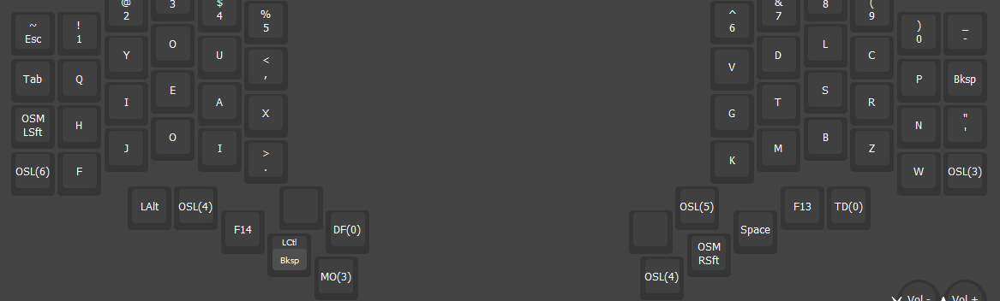
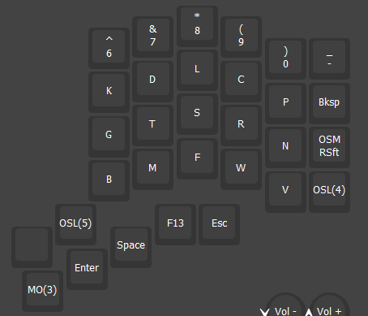
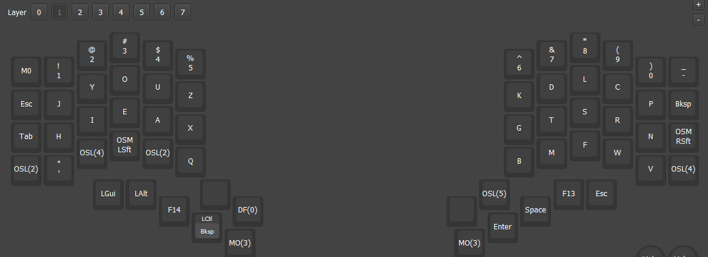
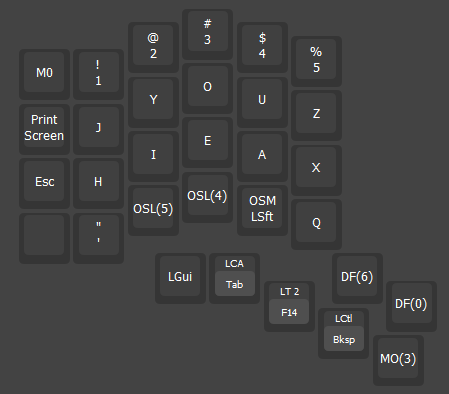
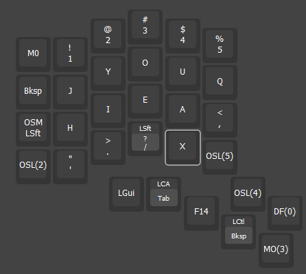
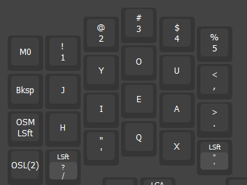
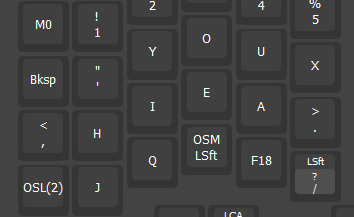
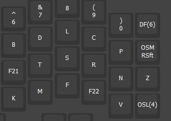

F13/F14 = Magic

OSL2 = Punctuation Layer. OSL4 = Symbol Layer

Punctuation moved to magic key. Tap for magic, hold for punctuation layer

F18 = Repeat

F21 = G + Magic

F22 = W + Magic

F13 = Magic

F14 = Repeat

F15 = X + Magic

F16 = J + Magic

F17 = Q + Magic

F18 = Z + Magic

F19 = B + Magic

F20 = C + Magic

F21 = G + Magic

F22 = H + Magic

F23 = K + Magic

F24 = Shift + Magic

(TD11) = `'` on tap. `-` on hold. `"` on double tap
